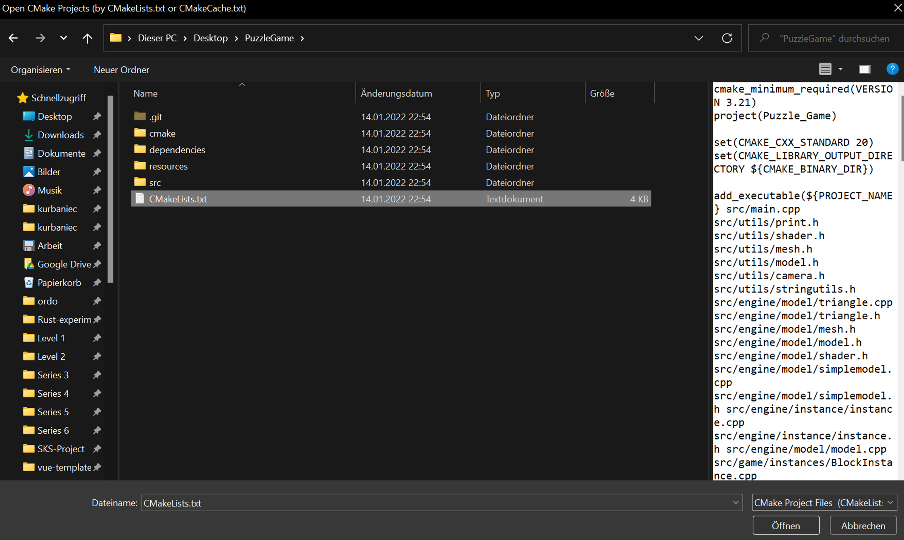

<h1 align="center">
  <br>
    
  <br>
  Puzzle Game 🕹️
  <br>
</h1>

<h4 align="center">Simple puzzle game based on OpenGL</h4>

## 🛠️ Build

Building the game using Visual Studio with CMake and the MSVC toolchain under Windows:

`File > Open > CMake`


Select `CMakeList.txt`



Select the correct target `Puzzle_Game.exe`


## :package: Dependencies 

* `GLFW`       
  OpenGL Utility Toolkit library for window management & more.
* `GLAD`         
  OpenGL Loading Library that loads pointers to OpenGL functions at runtime, core as well as extensions.
* `GLM`     
   Header only C++ mathematics library for graphics software.
* `SOIL2`      
  Tiny C library used primarily for uploading textures into OpenGL.
* `ASSIMP`      
  The Open Asset Import Library (short name: Assimp) is a portable Open-Source library to import various well-known 3D model formats in a uniform manner.

All dependencies (suitable for use under Windows) are found in the `dependencies` folder. One does not need to configure system paths or anything else in order to use them, CMake does all the heavy lifting for you.

## :sparkles: Features

Game controls:

* `W A S D` - Move Player
* `Arrow Key Up Down Left Right` - Move Camera
* `Mouse Scroll` - Move Camera (Orbit) / Zoom (Free)
* `Space` - Change Camera Mode (Orbit/Free)
* `Escape` - Remove Mouse focus

## :book: Documentation

Checkout the `git` history!

```
git log
```

## :thinking: Problems while Building

* `cmake_minimum_required`

  Check if your running the latest CMake version. You can also specify it explicitly under `Manage Configuration > Advanced > CMake executable`. A typical path is `C:\Program Files (x86)\Microsoft Visual Studio\2019\BuildTools\Common7\IDE\CommonExtensions\Microsoft\CMake\CMake\bin` or `C:\\Users\\...\\AppData\\Local\\JetBrains\\Toolbox\\apps\\CLion\\ch-0\\...\\bin\\cmake\\win\\bin\\cmake.exe`.
  
  To set the CMake executable update `CMakeSettings.json` in a
  
  ```json
  {
    "configurations": [
      {
        "name": "x64-Release",
        "generator": "Ninja",
        "configurationType": "Release",
        "inheritEnvironments": [ "msvc_x64_x64" ],
        "buildRoot": "${projectDir}\\out\\build\\${name}",
        "installRoot": "${projectDir}\\out\\install\\${name}",
        "cmakeCommandArgs": "",
        "buildCommandArgs": "",
        "ctestCommandArgs": "",
        "variables": [],
        "cmakeExecutable": "<path-to-cmake-executable>"
      }
    ]
  }
  ```

* Large File Size

  One can shrink the resources folder and remove some development related files:

  ```bash
  find . -iregex '.*\.\(jpg\|png\|blend\)$' -type f -delete
  rm -r .cmake/
  rm -r CMakeFiles/
  rm -r Testing/
  rm -r resources/objects/backpack/
  ```

## 👍Special Thanks

* [Learn OpenGL - Joey de Vries](https://learnopengl.com/)
* [Ultimate Platformer Pack - Quaternius](https://quaternius.com/packs/ultimateplatformer.html)
* [C++ reference](https://en.cppreference.com/w/)